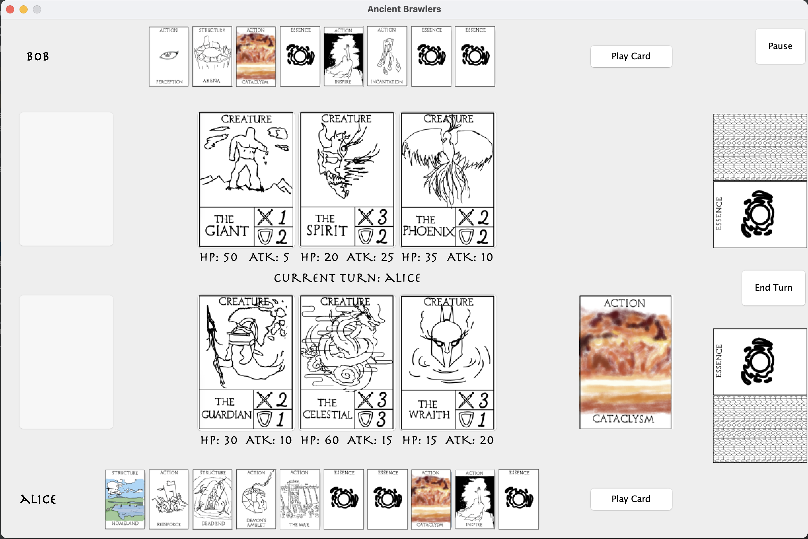
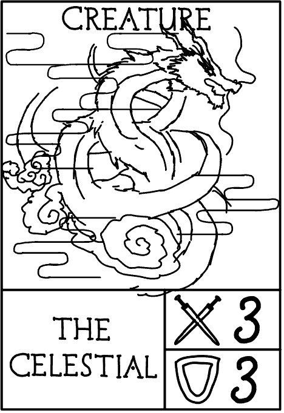
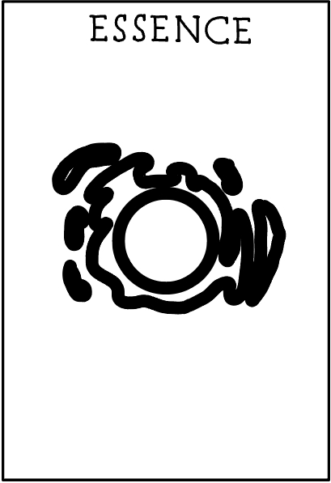
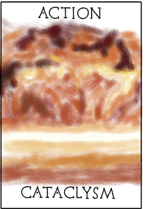
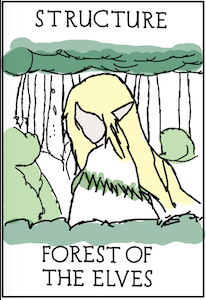
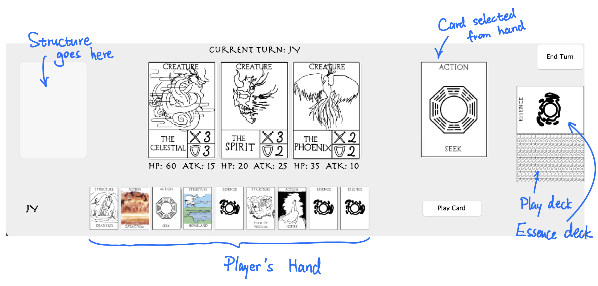
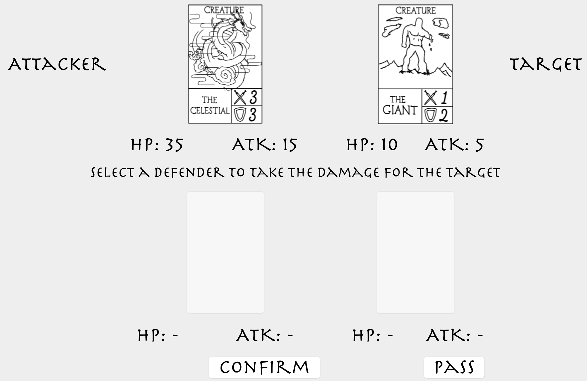
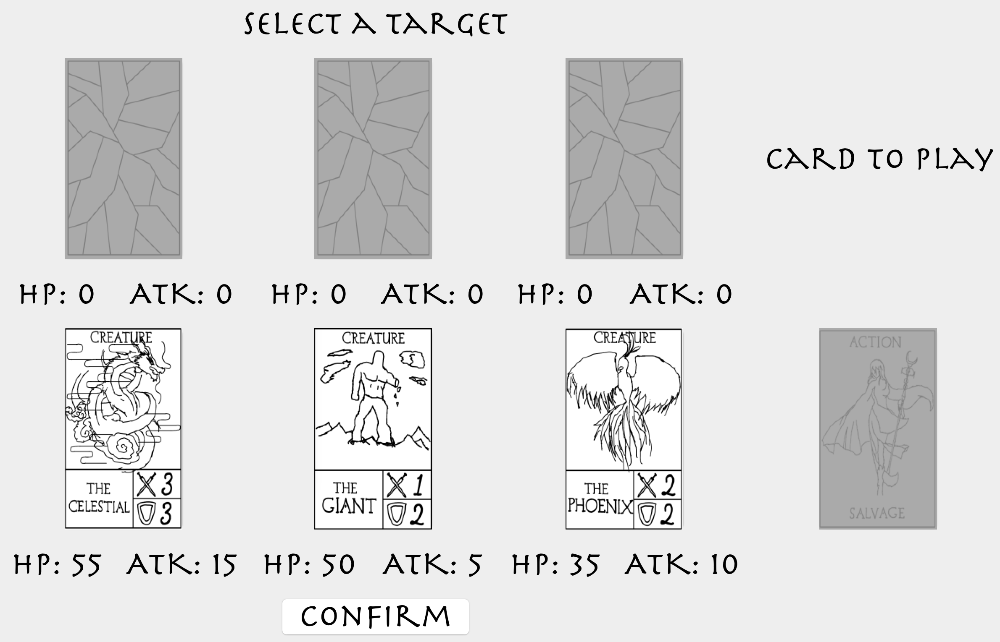

# Ancient Brawlers
Ancient Brawlers is a Trading Card Game (TCG) that is currently designed for two players to play locally. In this game, 
each player controls three "creatures" (used for battle), and each has a deck of cards containing "actions" and 
"structures" (used as additional support). Players must fight to defeat all the opponent's creatures, by directing creatures
to attack and giving them boosts using the deck cards. Like all TCGs out there, cards in the deck have different effects, 
so use them strategically, and outwit your opponent!

## Table of Contents
* [Specifications (Running the game)](#specifications)
* [Game Rules and Tutorial](#game-rules-and-tutorial)
* [The Game's Software Architecture](#software-architecture)
* [Design Patterns](#design-patterns)
* [Credits](#credits)

## Specifications
This program is written in Java, using JDK `Amazon Corretto version 11.0.19`. Unit tests are written with `JUnit 5`.

To run the game, clone this repository and run the file `src/main/java/AncientBrawlersApp.java`.

The data in this game are stored in JSON files. Make sure you have the JSON dependency added to your configuration file.
The project repository contains the `build.gradle` file which should already include the necessary settings.

Note that the graphics may vary depending on the platform. For example, running the application on Windows and Mac may look
different. This is mostly due to Java Swing GUI.

## Game Rules and Tutorial
During gameplay, players will mostly be looking at this screen:

Let's break it down:

### Cards: Creature, Essence, Action, Structure

This is a *Creature* card. The two numbers in the bottom right corner of the card shows the *Attack cost* (top) and 
*Defend cost* (bottom). A Creature also has *Hit-points* and *Attack Damage*, but these stats are shown in separate 
components in the gameplay screen.

This is an *Essence* card. It is the *cost* for a creature to attack or defend. During the start of a player's turn, 
there will always be two Essence cards given to the each player at the start of their respective turns.

This is an *Action* card. It is like a "spell card" that a player can use during their turn. Action cards are contained 
in every player's deck. Each unique Action card has its own effects, and it will have a description that shows when you
hover your mouse over the card. For example, the card we are seeing right now is "Cataclysm", and its description is 
"Deal 10 damage to ALL creatures." (You didn't misread it, this card deals damage to *everyone*, but use it wisely and you
may just claim victory!)

This is a *Structure* card. It is similar to an *Action* in that it has effects and is in the player's deck, but the catch 
is that playing a *Structure* card will set it on the game board (until you play another one to take its place, or until 
your opponent destroys it with some *Action*). Most importantly, the effects on a *Structure* can keep triggering, as long as
the game has come to the required moments (start of turn, end of turn, etc.). For example, the "Forest of the Elves" card 
has the following description: "At the end of your turn, restore 2 HP to all friendly creatures."

### The player's resources

Let's take a closer look at one side of the game board.

The bottom row displays the cards currently in the player's hand. You can click to select any of them, and the selected 
card will be shown just above the "Play Card" button. Once you've decided, hit that "Play Card" button and the effects from
the selected card will be unleashed! If you select and play a Structure, it will show up at the left-most card slot show in
this image. Finally, on the right side of the board, you get to see the supplies you have: a deck of cards (Action and 
Structure) and another deck full of Essence (unlimited Essence!).

### Attacking

To attack, the player must select a friendly creature, then select an enemy creature. The attack will initiate once this 
sequence of actions are taken. When a player decides to let a creature attack an enemy creature, the game will switch to 
this screen:

The game will calculate for the other player whether they have enough Essence to spend on a Defend move, and any available
defending creatures will show up on the bottom two card slots. In this situation the player under attack can do two things:
- Clicking "Pass", letting the attack proceed, and the target creature *takes damage*.
- Selecting one of the defenders and clicking "Confirm": the defending creature will *take the damage instead*.
So, you may want to coordinate your creatures to protect a certain powerful creature, and let that creature be ready to
deliver a powerful strike!

### Target Selection

When an Action is played and its effect is on a single creature, then we see a target-selection screen:

Here, the card "Salvage" has the effect "Restore 10 HP to a friendly creature." Thus, we see that amount the six creatures
that are on the game board, the available choices are only the 3 creatures friendly to the player who used this card.
In this screen, you will have to select a target to proceed.

### Game Flow

A typical turn goes like this:
1. The turn begins. The player draws 2 deck cards, and also draws 2 Essence. Buffs are cleared during this stage.
2. Middle stage of the turn. The player can play cards from their hand (as many as they want, but Essence cards can't be directly played).
3. Next, if the player is done, they can press the "End Turn" button, and the turn will *proceed to the end phase*.
4. Or, if the player decides to attack, then the attacking phase is processed. After that, the turn *also proceeds to the end phase*.
5. The turn ends. Effects that trigger during this stage shall take place. Finally, the turn is passed to the opposing player.

Now you are ready to start the brawl!

## Software Architecture

### Adherence to SOLID principles
* **Single Responsibility Principle (SRP)**

  Each module should only be responsible to a single actor. We enforce this rule on various scales in the program.
  
  In small scales, we have each class being responsible for a single task. For example, an `ActionCard` holds the name of
  an Action card, the description, and the corresponding effects. As for the triggering of the effects, that is a job for
  a different class. We make sure that the cards are only responsible for storing the information, as for using those 
  information, that's for other classes to manage.
  
  In large scales, we make sure every package/subpackage only serves one role. For example, the `entities.cards` package
  holds all types of cards and their information. This is separated from the other package `entities.cardEffects`, which 
  solely deals with the effects that go on the Action and Structure cards. The `cards` have some dependency on the
  `cardEffects`, but it is still easier for maintenance by separating the two collections of classes.
  
  The other significant example for SRP is that we have different controllers and presenters when it comes to the interfaces
  in the Clean Architecture design.

* **Open/Closed Principle (OCP)**

  We can see OCP from the inheritance relationship in the `entities.cards` package. All card types extend the `Card` abstract
  class, which means if we introduce new types of cards in the game, we can just "attach" a new class file to this package, and
  there is no need to modify existing code. Another example is the `entities.cardEffects` package. This one is probably the most
  frequently changed package if we decide to expand the game and design new cards. So, any new effects only need to extend the 
  existing effect interfaces, which is again allowing extensions but no modifications.

* **Liskov Substitution Principle (LSP)**

  A straightforward example of LSP is that the a player's hand is represented by a list of `Card` (the parent class of all cards), 
  while we are inputting items of type `ActionCard`, `StructureCard` and `EssenceCard`. The program still works when we add 
  these child class types into the list, and that is the definition of LSP.

* **Interface Segregation Principle (ISP)**

  One example is that only the `ActionCard` and `StructureCard` types have descriptions and effects, so we make them implement 
  a `Playable` interface, with the methods that get those descriptions and effects. As for the other cards, like `CreatureCard`,
  we don't implement the `Playable` interface on it, so the `CreatureCard` is not dependent on code extra code that it doesn't use.
  
  A more plain example is that we have broken down classes into small enough pieces, so that the import statements in every
  class are exactly the things they need, without extra/unused code.

* **Dependency Inversion Principle (DIP)**

  One example (aside from the use cases) is the relationship between Presenter, ViewModel and View. The presenters send game state information
  into the screen components. But if we do it directly, then we have a higher level module dependent on a lower level, more volatile module.
  So to mitigate this problem we just introduce an interface in between, letting both modules depend on this abstraction. The ViewModel
  is in the interface layer along with the Presenter, so the Presenter can talk to it without problems. Meanwhile, we have the View 
  looking at changes in the ViewModel, and updating when necessary.
  
  In fact, the DIP can be seen throughout the entire program structure. Anywhere we see an interface, we are probably enforcing the DIP rule.
  This is obviously true for the use case packages, since we are following Clean Architecture.

### Clean Architecture

The typical four layers of Clean Architecture are entities (enterprise business rules), use cases (application business rules), 
interfaces (like API), and frameworks (UI, database, device). This card game is also just another kind of software, thus 
I've drawn some analogies.

The "enterprise business rules" for this card game are the core game objects. The cards, effects, players, and decks are 
all part of this core layer. So we've put them into the package `entities`. Then, the application business rules are those
that make use of the game objects (i.e. putting some object together with another, using methods in one object to modify its 
state, etc.). Again, following SRP, we've separated the use cases into many subpackages, which can be seen under the main
`use_cases` package.

Then, for the Interface Adapters Layer, we create the many types of controllers and presenters to cater for the use cases.
This layer would be the API to our game program, which makes it possible to migrate the game to a different tool for designing
the UI. Finally, the frameworks layer currently just uses Java Swing for the game UI, and we also have a package specifically
for data access (interactions with databases, which are just JSON files for now).

## Design Patterns

### Model-View-Presenter (MVP) and Model-View-ViewModel (MVVM)

Clean Architecture shares many design patterns, including MVC, MVP, MVVM. But depending on the program's intents, the final
product may lean closer to one of the many patterns. 

For this card game, I've chosen to use MVP, with a mix of MVVM. The highlight is in the addition of the ViewModel, for the
View is observing changes from the ViewModel, and when the Presenter update the ViewModel, the View (game UI) will update itself
to match the changes to the game state.

Using this pattern, we have extracted the UI to be a separate component, so we can choose to build a better UI while working
on game logics simultaneously. If we have a larger team, then one group could focus on UI design, while another group focuses 
on the actual numbers and letters to be shown on the UI.

### Simple Factory

For a systematic way of building the card effects during runtime, we use a simple factory pattern. This can be seen in the 
class `entities.cardEffects.CardEffectFactory`. With this factory class, we separate the object construction code from the
code that actually uses the objects. Although if the game were to expand, we would have to redesign the way these card effects
are stored, and will need to adopt an actual Factory Method pattern instead.

### Observer

There are two sets of observer patterns used between the Interface Layer and the UI layer. 

The `GameFrame` (a class in UI) is a `FrameUpdateListener`, observing the `GameFrameModel` (a class in Interface Layer). The `GameFrameModel` is 
given to many presenters (actually through dependency injection), so whenever a presenter has brought updates to the UI
content, it would notify the observers. In this case, the only observer is the `GameFrame`, and it will tell its components to
update themselves in response to the notification from the `GameFrameModel`.

This leads to the second set and more crucial set of observers––––the many `Screen` classes stored inside the `GameFrame`.
Each screen class is a `ScreenUpdateListener`, and they are all observing the `GameFrame`. When the `GameFrame` receives 
instructions to update itself, it is actually notifying all its observers to update themselves. So, with this entire design,
we have made the View(s) observe changes in the ViewModel(s), which is actually managed by the Presenter(s) behind the scenes.

Meanwhile, we still maintain the dependency inversion principle, as the Listener classes are defined in the Interface Layer,
and the UIs are merely using them.

### Dependency Injection

The most important example of dependency injection is in how we manage the `GameState` object. Every use case interactor 
class must make modifications to the same `gameState`, otherwise we fail to connect all the game logics together. So we
define an attribute in every use case interactor, with the type `GameState`, but we don't create it inside the interactor.
Instead, during program setup (which happens in the `main()` in `AncientBrawlersApp.java`), we inject the same `gameState` 
variable into all the interactors when we construct them. This is one of the key features that allow the game to come together.

## Credits

Game Design: [Jiaxun (Kevin) Yang](https://github.com/Kevin22888)\
Software Design: [Jiaxun (Kevin) Yang](https://github.com/Kevin22888)\
Programmers: everyone\
Bug fixes: Ethan Hsu, Kaifeng Li\
Unit tests: Ethan Hsu, Pranav Sethi\
Documentation: Ethan Hsu, Jiaxun Yang
